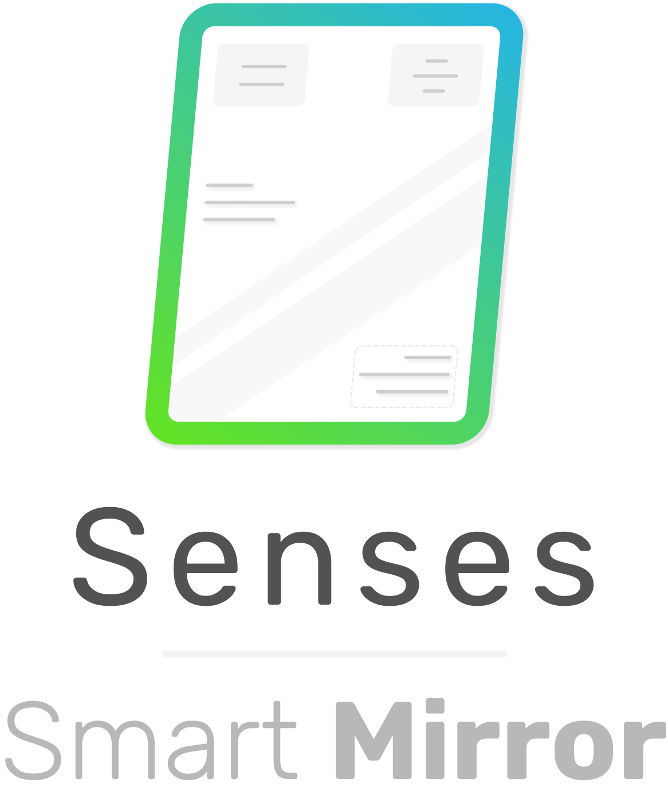
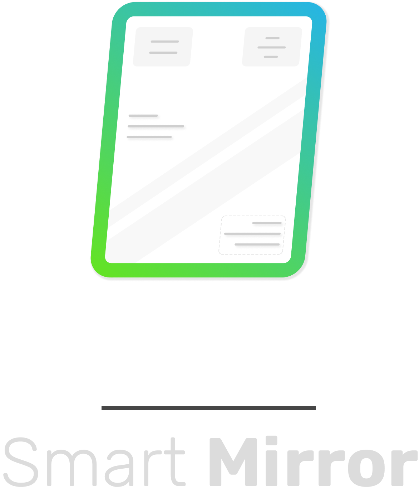

<p align="center">
  <a href="https://senses-smartmirror.com#gh-light-mode-only">
    
  </a>
  <a href="https://senses-smartmirror.com/#gh-dark-mode-only">
    
  </a>
</p>

<br /><br /><br />

# Senses - Smart Mirror

Senses - Smart Mirror is modern, clean & minimalistic designed software for your Smart Mirror. Senses is open source and rich of widgets ready to provide you an amazing view of day-to-day data.

More information: [Senses - Website](https://senses-smartmirror.com).

<p style="text-align: center">
  
  &nbsp;&nbsp;&nbsp;&nbsp;&nbsp;&nbsp;&nbsp;
  
</p>

## Installation

For the full installation steps please see [Senses - Documentation](https://docs.senses-smartmirror.com).

Quick installation for the Raspberry Pi 3+

```
curl -sL https://raw.githubusercontent.com/senses-smart-mirror/senses-scripts/main/lib/raspberry-pi-install.sh | bash
```

## Create your own Widgets
Craft your own widgets with the data you want to display on your Smart Mirror and share you widget with the community. We got you covered with the Senses - ClI tooling for rapid development!

The full documentation on how to work with Senses - Smart Mirror can be found here: [Senses - Documentation](https://docs.senses-smartmirror.com).

## Features

- Mobile App
- 35+ Widgets
- Build & Extend
- Profiles
- Voice Integration
- Animations
- Custom Widgets
- Custom Modules
- Wallpaper module
- Highly crafted widget design
- Minimalistic design
- Conditional show
- Mobile Web App
- Profiles
- Easy configuration
- Animations
- Easy configuration with App
- Center Column
- Meaningful Notifications
- Wake up screen
- Different build-in fonts
- In App Auto updates
- Dynamic Text widget
- Profile Welcome Messages
- Mirror wide settings
- Example widgets for development
- Full Clock
- ... and more coming soon!

## Discord

For any question regarding the software, helping out improving the code or showcase your Smart Mirror. Find us on Discord!

Invite link: https://discord.gg/mRtYr9W7bY

---

## Enjoying Senses?
As an independent project, Senses relies on community backing for its sustainability.

If you are enjoying Senses please consider a donation to help us cover the operation costs and work on new features. Feel free to reach out if you want to donate outside Paypal or have any questions about the future roadmap.

[Donate with Paypal](http://senses-smartmirror.com/#donate)

## Special Thanks

Special thanks to [Petar Blazhevski](https://github.com/petarblazevski) for helping out and working on the Senses - Cli. Also big thanks for everybody that contributed to Senses - Software so far.
